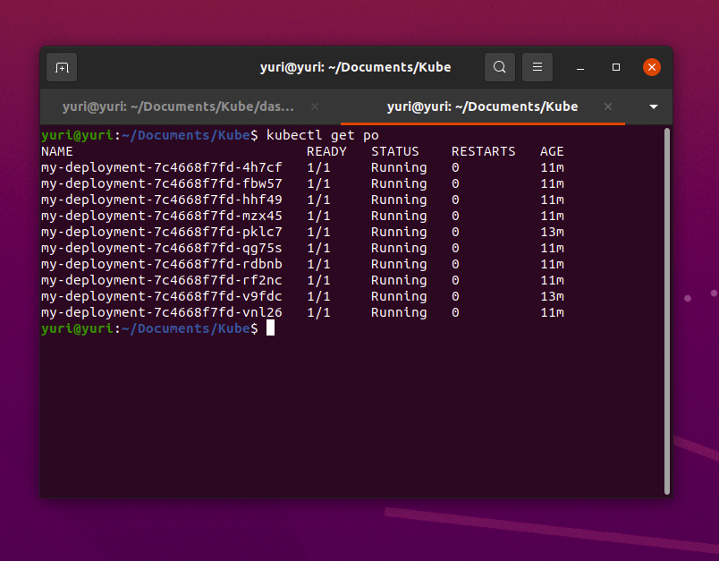
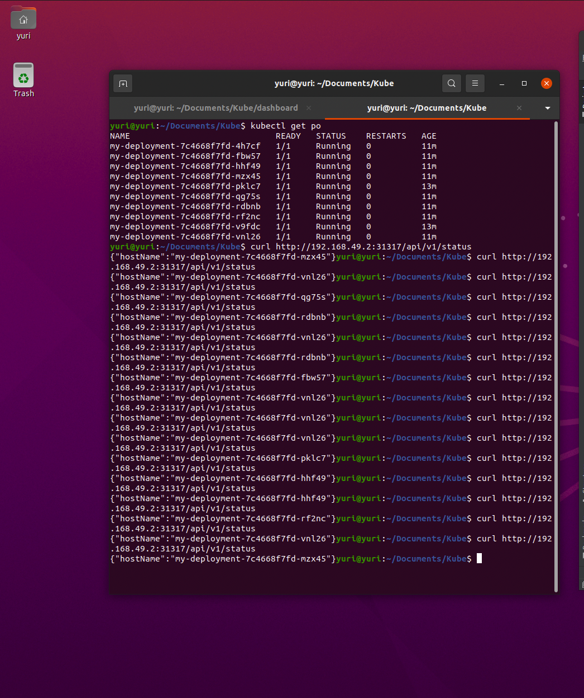
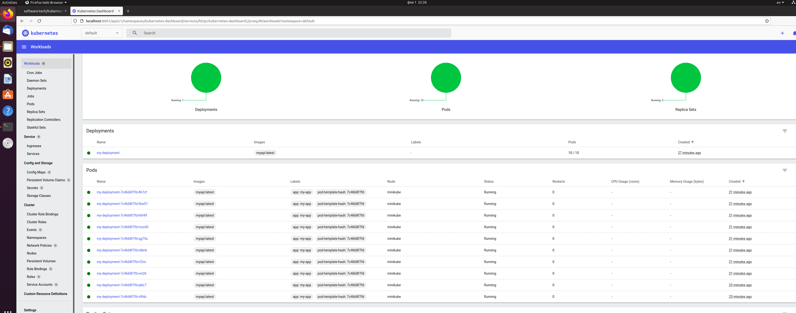

# Технологии разработки програмного обеспечения #
## Лабораторная работа №2: создание кластера Kubernetes и деплой приложения ##
### Садыев Юрий, гр: МБД 2131  ###
### Целью лабораторной работы является знакомство с кластерной архитектурой на примере Kubernetes, а также деплоем приложения в кластер  ###

## deployment.yaml: ##
```aidl
apiVersion: apps/v1
kind: Deployment
metadata:
  name: my-deployment
spec:
  replicas: 10
  selector:
    matchLabels:
      app: my-app
  strategy:
    rollingUpdate:
      maxSurge: 1
      maxUnavailable: 1
    type: RollingUpdate
  template:
    metadata:
      labels:
        app: my-app
    spec:
      containers:
        - image: myapi:latest
          imagePullPolicy: Never
          name: myapi
          ports:
            - containerPort: 8080
      hostAliases:
        - ip: "192.168.49.1"
          hostnames:
            - postgres.local
```

## service.yaml: ##
```aidl
apiVersion: v1
kind: Service
metadata:
  name: my-service
spec:
  type: NodePort
  ports:
    - nodePort: 31317
      port: 8080
      protocol: TCP
      targetPort: 8080
  selector:
    app: my-app
```
### Скриншот пункт 3.3 <i>kubectl get po</i> Вид всего рабочего стола ###

### Скриншот пункт 3.3 <i>kubectl get po</i> Вид терминала ###

### Скриншот пункт 3.4 <i>curl http://192.168.49.2:31317/api/v1/status </i> Вид терминала ###
 
### Скриншот пункт 3.5 <i>http://localhost:8001/api/v1/namespaces/kubernetes-dashboard/services/https:kubernetes-dashboard:/proxy/</i> Вид браузера ###
 

### Ссылка на видео https://disk.yandex.ru/i/NczvHEA1FYNJvw ###
